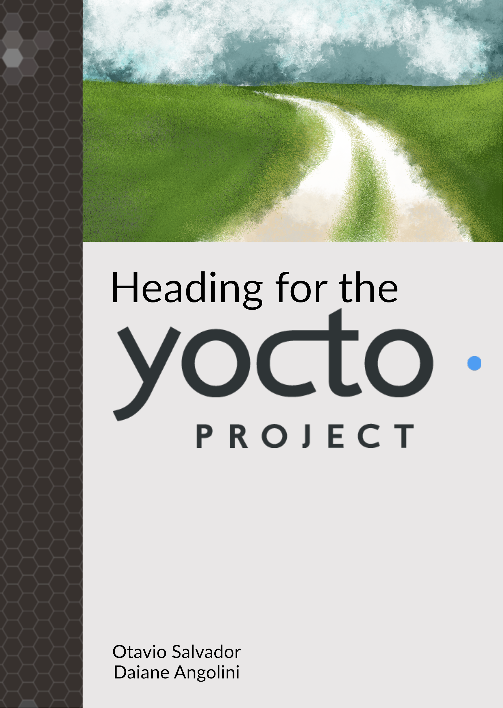

// SPDX-License-Identifier: CC-BY-SA-4.0
Heading for the Yocto Project
=============================
Otavio Salvador, Daiane Angolini
v1.0, 2016-09-08
:doctype:   book
:toc:       left
:toclevels: 2
:pagenums:  1
:front-cover-image: 
// The license is stated once here. Every other place in the book uses
// these attributes, so the statements cannot drift apart.
:license-id:   CC-BY-SA-4.0
:license-name: Creative Commons Attribution-ShareAlike 4.0 International License
:license-url:  https://creativecommons.org/licenses/by-sa/4.0/
:copyright: {license-id}

include::preface.adoc[]

:imagesdir: 01-The-Yocto-Project/images
include::01-The-Yocto-Project/chapter.adoc[]

:imagesdir: 02-Benefits-for-your-products/images
include::02-Benefits-for-your-products/chapter.adoc[]

:imagesdir: 03-Heading-for-Yocto-Project/images
include::03-Heading-for-Yocto-Project/chapter.adoc[]

:imagesdir: 04-The-Yocto-Project-community-ecosystem/images
include::04-The-Yocto-Project-community-ecosystem/chapter.adoc[]
